# ECE 118 - Final Project Technical Report

## Jack Baskin School of Engineering – ECE 118

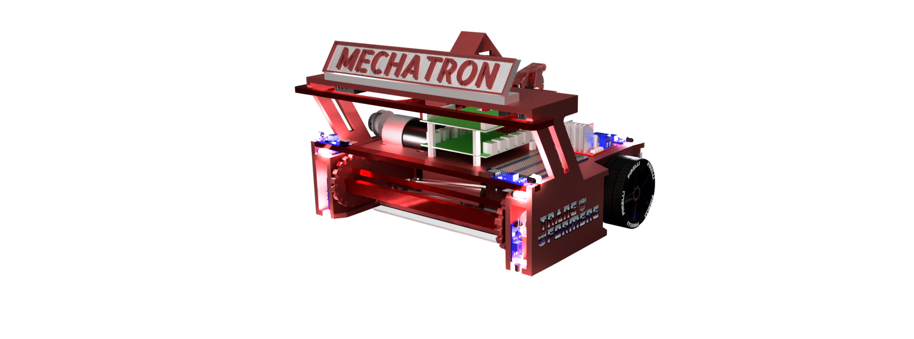

<!-- **Final Project Technical Report** -->

- **Instructor**: Gabriel Elkaim
- **Students**: Cole Schreiner, Qingyuan Cao, James Huang
- **Emails**: [caschrei@ucsc.edu](mailto:caschrei@ucsc.edu) | [qcao10@ucsc.edu](mailto:qcao10@ucsc.edu) | [hhuan143@ucsc.edu](mailto:hhuan143@ucsc.edu)
- **Date**: June 14th, 2024

---

# Background

# 

This course, ECE 118/218 is based on the Smart Product Design sequence (ME218A, B, C), and the one quarter Mechatronics class (ME210/EE118) offered at Stanford by the Smart Product Design Lab, headed by Dr. Ed Carryer.

Mechatronics is the synergistic combination of mechanical engineering ("mecha" for mechanisms), electronic engineering ("tronics" for electronics), and software engineering. The purpose of this interdisciplinary engineering field is the study of automata from an engineering perspective and serves the purposes of controlling advanced hybrid systems such as production systems, synergy drives, planetary-rovers, automotive subsystems such as anti-block system, spin-assist and everyday equipment such as autofocus cameras, video, hard disks, cd-players, washing machines, lego-matics etc.

Mechatronics is centered on mechanics, electronics, and computing which, combined, make possible the generation of simpler, more economical, reliable, and versatile systems.

The word "mechatronics" was first coined by Mr. Tetsuro Moria, a senior engineer of a Japanese company, Yaskawa, in 1969. Mechatronics may alternatively be referred to as "electromechanical systems," or as "smart products."

# Project Specification

# 

( As stated in the Project Spec Manual )

Your task is to build a small autonomous robot (droid) that can effectively and robustly navigate a standardized field, and locate and trap the targets. You must identify the discharge location, and contain the balls or discharge them to the opponent’s field. You will receive points based on the number of balls left on your field at the end of the time (see field specs below). The match is won by cleaning up your field. You will be doing this in teams of three, over the next five weeks, during which time you will design, implement, test, and iterate until you can reliably complete the task. There will be practice fields in the labs and lots of help and guidance available to you. Don’t panic.

Yet. The field of play is a large white 4’x8’ surface with 2” black tape markings and a low (4”) wall separating yours from your opponent’s field. The wall contains a slot (marked with a track-wire) with a one-way door to push balls over to your opponent’s field. The edge of the field is marked with 2” black tape, and your robot must detect the tape and stay on the field (more than ½ your robot moving out of bounds will disqualify you from the round).

There are two towers on each field (one with a standard 2KHz beacon) from which the 25mm chrome balls will eject randomly. There are also weather-stripping bumpers at the edge of the 4’x8’ field to prevent balls from rolling away.

If your bot cannot resolve collisions (either with the obstacle or the walls) within 5 seconds, it will be disqualified. There will be an obstacle (dead bot) on the field in a random location/orientation not blocking the trap door; you must work around it.

The 2kHz IR beacons on the ball dispensing towers will be illuminated for the entire match. Only balls contained within your robot or pushed into the opponent’s field through the slot count as “cleaned.” Scores will be computed by the number of balls on your opponent’s field minus the number of balls on your field (1 point for each ball).

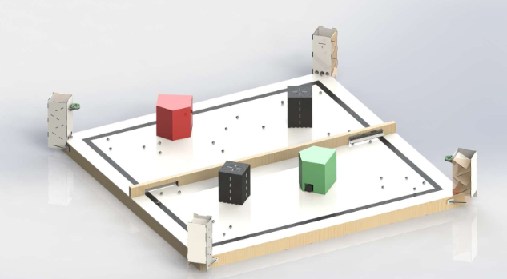

*Figure 1: Field of Play for the L’Escargo vs. Slug. Black tape boundaries and alignment marks are 2” thick PVC tape. The trap door slot is marked by track wire (24 - 26 Khz). The ball dispensing towers are at the diagonal corners of the field, with the standard 2 Khz beacon placed in front of one of the towers.*

The slot has a one-way door which can be pushed open to deposit balls to your opponent’s field (see Fig. 1).

Each droid must start the match within an 11” cube volume (parts may move after the round begins) and remain intact throughout the match. Jamming your opponent in any way is disallowed. Robot sizing will be checked with the Cube of Compliance.

Your robot is required to detect collisions and resolve them (e.g. if an obstacle is blocking your path; you need to be able to maneuver around any immovable obstacle). You are required to break contact within 5 seconds or be disqualified.§

Your robot is required to detect and maintain itself within the field of play (field boundary marked by 2” black tape). Failure to keep ½ of your robot within the field of play will result in disqualification.

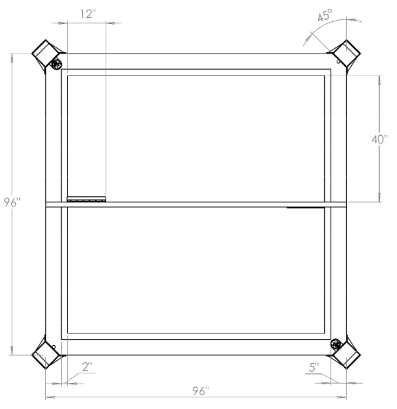

*Figure 2: Scale drawing of the field of play including dimensions and designated areas (all dimensions in inches). Note that the beacons are located on the top right and lower left towers. The slot doors are 2” high and located at the edge of your field and can only be opened in the direction of the opponent field.*

# Minimum Specification

# 

( As stated in the Project Spec Manual )

In order to pass this class, your robot must demonstrate that it can complete the task.

While the rules and specifications are below, teams are free to embellish, go beyond, and otherwise have fun—however, we suggest you aim for “min spec” first, and then go back (and go nuts).

Your robot begins the round randomly placed within your playing field in a random orientation. An (immovable) obstacle is placed somewhere on the field, but not blocking the trap-door to the other field.

At the start of every round, your droid will be reset. The towers will have their IR beacons (2KHz) illuminated. Balls will drop into the field at a rate of 20/min (approximately), evenly spaced in time (again, approximately).

Your robot should find the balls. You must contain the balls within your robot, or push them through the trap-door to the opponent’s field. Note that balls pushed out of the field other than through the trap door will NOT count as “cleaned.” Any ball outside of the field lines will be recovered and resent through the drop tower.

**Min-spec is defined as trapping/discarding 75% of the balls deposited on the field (30 during 2 min round), and putting at least 2 balls through the slot-door to the other field.**

Should it become apparent that a robot will not complete a round (for example, if it fails to resolve a collision for more than 5 seconds, or cannot stay on the field, your robot will be disqualified and the round will end.

In the tournament, you play against another team; each will start on its own field. Note that during Tournament play (and only tournament play), the rate of depositing balls will likely increase. Each field will have its own obstacle randomly placed.

If you win the match, your robot advances in the tournament, victory will be awarded by points. Should a tie occur, we will attempt a rematch.

Points are awarded based on the net balls cleaned as determined by the number of balls on your field vs the number on your opponent’s field. No points are awarded for balls outside the 2” tape marks. Balls that leave the field of play will be gathered up by the tutors and reloaded into the dispensing towers.

Robots will be disqualified for failing to resolve collisions (must break contact by 5 seconds) with either the walls or obstacle, or for failure to stay on the field.

# Design Strategy

# 

To effectively execute our navigation strategy, we needed a bot that would in theory, efficiently pick up balls with a reliable intake as well and dump balls as soon as we drove up to the gate. Our philosophy for design simply put was “less electronics = reliable mechanisms”. This mainly refers to trying to reduce the electromechanical parts on our bot.

As a team, we came up with 2 motors per wheel and 1 motor for the intake. We observed that many teams relied on a servo motor in order to open the gate. Instead of opting for this approach we sacrificed a portion of the 11”x11”x11” build real estate given to us in order to design a mechanism that allows us to drive up the gate and open it without the need of electronics.

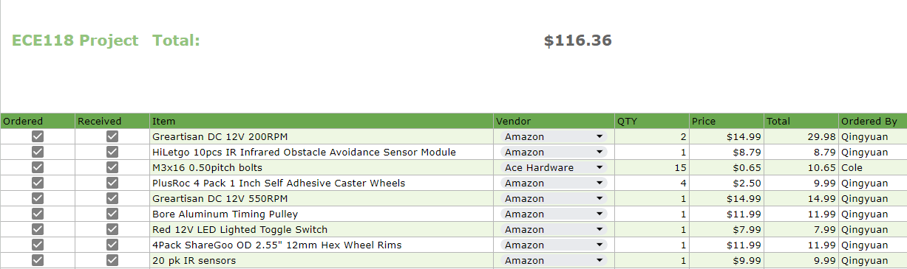

*Figure X: Project bill of materials. Note that most of these items are from amazon*

# 

# Sensors & Electronics

# 

Our choice of sensors heavily relied on the LM393 photoelectric sensor produced by HiLetgo. This specific sensor enabled our bot to be able to sense both the wooden wall as well as the floor and tape. Aside from sensors, we also used limit switches to act as bumpers to be able to detect when we’ve “bumped” into an obstacle. We also used the L298N H-Bridge for motor driving and the UNO_32 from Microchip as our main microcontroller.

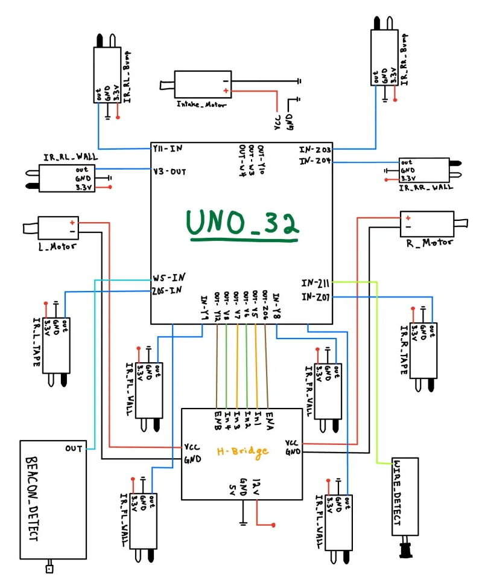

*Figure X: Diagram of our sensor suite. Note that the Wire detector abd Beacon detector were never used in actual min spec check off.*

At the top of one of the ball dispensing towers is a 2kHz infrared beacon shaped like a hockey puck. Several weeks of the class were devoted to crafting and understanding how to create a beacon-detecting circuit to help the robot navigate the field. Our initial idea was to use the beacon tower to give the robot some positional awareness. This would allow it to use the beacon tower like a lighthouse and then it would use that to head in the direction of the track wire gate on the opposite corner of the field and dispense balls more swiftly. The beacon detector circuit consists of an infrared sensor that feeds the incoming signals to two non-inverting amplifiers. This incoming signal has a lot of noise which is then filtered out by a Butterworth filter, allowing only 2 kHz signals to pass. After filtration, this signal is passed to a peak detector, comparator, and LED buffer, which all create a digital signal in order to let us know whether or not the beacon detector is within sight of the 2 kHz beacon tower. The beacon detector circuit can be seen in the schematic below:

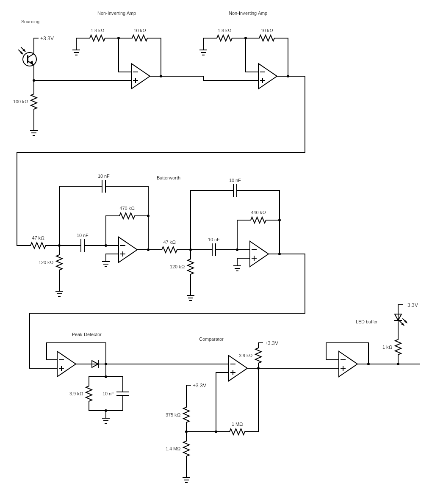

# 

# Navigation Strategy

# 

Our navigation strategy was based on how the balls grouped on the field. After numerous meetings and tests, we discovered that balls tended to gather along the wall rather than being scattered randomly. Using this insight, we developed an algorithm to navigate without relying on the beacon detector or trackwire, instead utilizing the field’s geometry. We designed a robot that would bounce around within the tape boundaries until it found the wall. Once it located the wall, it would move back and forth along it to collect balls. This approach also provided a straightforward navigation strategy for finding the trap door and depositing the balls. Each time the robot encountered the wall for the first time, it would turn left and follow the wall. We mounted four infrared sensors at the front of the robot to maintain a 1-inch gap between the robot and the wall, ensuring it never got stuck when turning. This wall-following behavior continued until the front-mounted tape sensors were triggered, prompting the robot to turn around and go to the other side. This process was repeated multiple times before making a deposit. By keeping a static count of the number of times the robot encountered tape, we could track its movements and always locate the trap door. After a set number of passes along the wall, we used several tape sensors mounted on the front and back of the robot to align the wheels parallel to the tape boundary, eliminating the need for a track wire sensor. Once the balls were deposited, the robot resumed its wall-following behavior until the game timer expired.

Our state machine begins in the “random” state, where the robot bounces off the tape and obstacles. We calculated that making 75° tank turns to the right was the most effective maneuver, allowing us to find the wall within three turns. When the infrared wall sensor is triggered, the robot transitions into the “wallride” state. This state is divided into two main parts: moving right and moving left, each with smaller states to ensure smooth transitions and turns along the wall from all angles. Using the static tape counter mentioned earlier, once the desired number of wall rides is completed, the robot transitions into the “deposit” state. This state is also divided into multiple parts to ensure smooth transitions for dispensing the balls into the goal. Depositing involves aligning the robot parallel to the tape to ensure it is perpendicular to the gate. The “ramming” stage then reverses the robot into the trap door and drives forward and backward multiple times, ensuring all the balls are shaken out and deposited through the gate. The vibrations from the ramming help empty all the balls. Finally, after depositing, the robot returns to the “wallride” state.

# Renders

# 

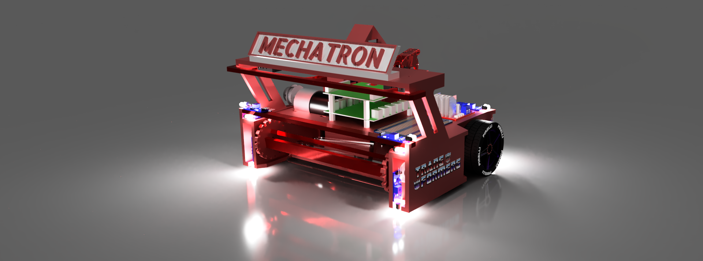

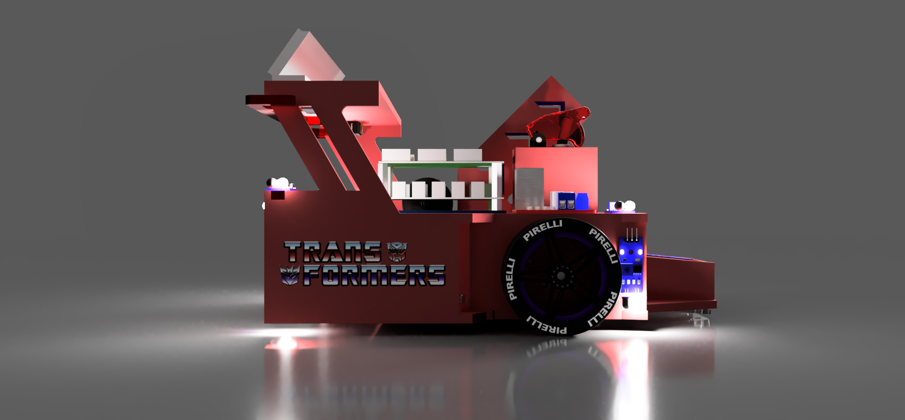

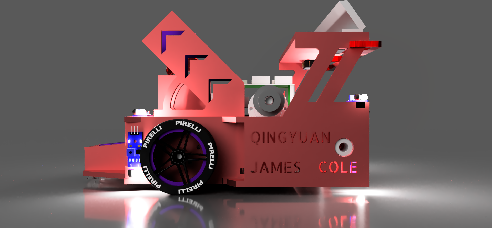

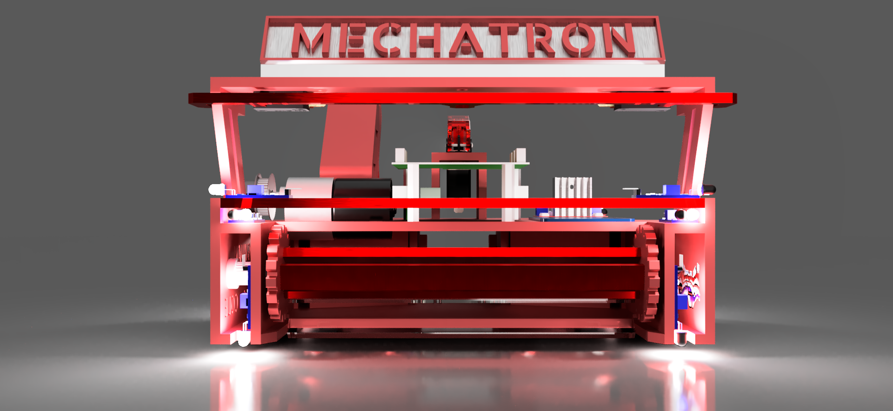

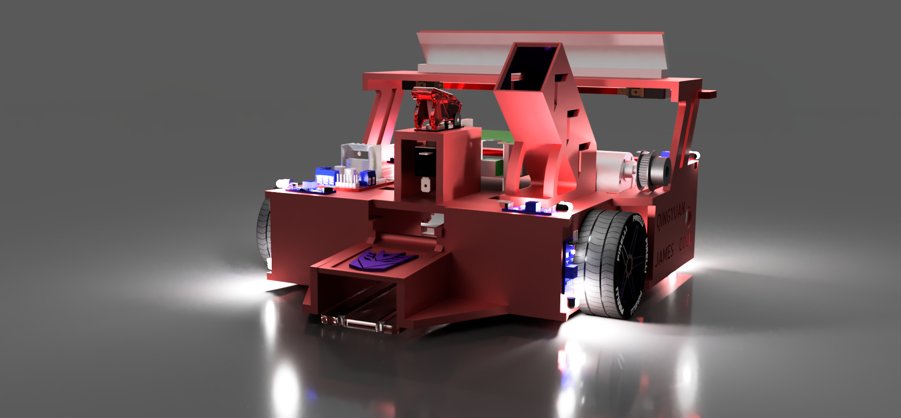

# Final Construction

# 

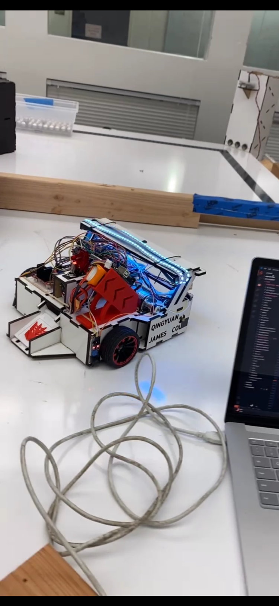
